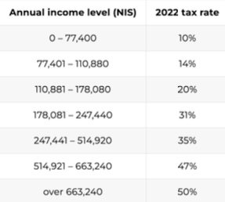

###Exercise set A
    arithmetic operations: 
        +  -  /  *
        %(modulus)  
        ** (exponentiation)  
        // (floor division)
    
    variables
    input / output
    conversions
    string
    slicing operator


1. Write a program that receives the width and the height of a rectangle and prints the area and the perimeter of the rectangle.


2. Write a program that receives a temperature in celsius and prints the temperature in fahrenheit.


3. Write a program that receives 2 numbers and prints the sum of 2 numbers and multiplication of them.


4. Write a program that receives a name of the user and his age and prints his birth year.


5. Ask the user for a number. Print out whether the number is even or odd.


6. Write a code that gets two numbers from a user and prints out the whole part of division of the first number by the second.
   For example, for input 5 and 2, you should return 2
   For input 25 and 4, return 6


7. Write a code that receives a 4-digits number and prints out the leftmost and the rightmost digit of the number.


8. Bob decided that he is going to donate 14% of his monthly salary to charity. Write a program that receives Bob's salary and prints how much he should pass to the charity.


9. Write a program that helps people who look for a new job. The program receives the user's current monthly salary and a new job’s monthly salary. The program will calculate what is the difference of the annual salary between the old job and the new job, and will print the difference.


10. For example, if currently I earn 8000 per month, and I consider taking a new job where I will earn 15000 per month, the program should print the following: “If you take the new job, you will earn 84000 more per year”


11. Write a program that receives the length of the movie in minutes, and prints out the length of the movie in the following format: hh:mm. 
For example, if the input is 135, your program should print: 2:15


12. Same as previous (8), but this time you get the time in seconds, and you should display the length in the format hh:mm:ss

---


###Exercise set B
      bool
      comparison operators: < <= > >= == !=
      logical operators: and or not
      conditional statements: if else elif
      nested statements

1. Get an integer number from the user and print the amount of digits in the number.


2. Get 3 numbers as input and print them from the smallest to biggest


3. Write a code that decides whether a person can ride a roller coaster. You can ride a roller coaster if:
   Your age is between 8 and 18, and your height is at least 115 cm
   If you are more than 18 years old, then the minimum allowed height is 100cm
   Write a code that receives as input person’s age and height, and prints “You can ride” if the person can ride the roller coaster, otherwise print: “You cannot ride”

   
4. Make a two-player Rock-Paper-Scissors game.
   Ask for player plays (using input), compare them, print out a message of congratulations to the winner.
   ```
   Remember the rules:
   Rock beats scissors
   Scissors beats paper
   Paper beats rock
   ```


6. Write a code that receives 3 numbers that represent a date (day, month, year) and prints out the season name of the date (winter, summer, autumn, winter). In addition, print out the amount of days in the month (30, 31, or 28/29 for february). **No need to take leap years into account.**


7. Write a code that receives the year as input and prints whether the year is a leap year or not.
   To be a leap year, the year number must be divisible by four – except for end-of-century years, which must be divisible by 400. This means that the year 2000 was a leap year, although 1900 was not. 2020, 2024 and 2028 are all leap years.


8. After you implemented B5 and B6, merge your solutions and write a program that receives 3 numbers that represent a date (day, month, year), and prints out the season name of the date (winter, summer, autumn, winter) and the amount of days in the month, taking into account leap years!


8. Annual income tax in Israel is calculated in tax brackets.It works according to the following table:


For example, on the first ₪77400 of your income you pay 10% tax, then on every shekel between ₪77401 and ₪110880 you pay 14% tax, then on every shekel between ₪110881 and ₪178080 you pay 20% tax, and so on.
Write a program that receives an annual salary from a user and calculates the income tax he has to pay.


9. Write a simple storage converter - a program that converts amount of bytes between byte units.
Your program should get from a user a number that represents storage amount, a unit of the amount provided (bytes, kb, mb, gb, tb), and a unit the user wants to convert the storage to.
The program should convert the amount to the desired unit.
For example, if the user asks to convert 2048 bytes to kb, your program should return: 2 kb
If the user tries to convert 128 mb to gb, the expected result is: 0.125 gb


10. Make more advanced storage converter. Write a program that receives a amount of storage from a user, including its units, and converts the amount to the highest possible unit such that the whole part of the number will be higher than 0. Round the result to first digit after the decimal point.

For example, if the user enters: 1000000 bytes, you should print: "967.6 kb". For the input 1200000 bytes, print: "1.1 mb"

---


###Exercise set C
      Python lists
      slicing operator on lists
      list methods
      string - slicing operator
      string methods - split

1. Write a code that receives 

2. Write a code that gets a word from a user and prints out the length of the word.


2. Ask the user for a string and print out whether this string is a palindrome or not. (A palindrome is a string that reads the same forwards and backwards)


3. In this exercise you will get used to reading code documentation, which is an important part of every developer's daily job. Use the following official python string documentation and solve the exercises:

   https://docs.python.org/3/library/stdtypes.html#string-methods
   1. Receive a word from a user, and print out whether the word ends with a vowel (a, e, i, o, u, y)
   2. Receive a string from a user, and print out whether the string contains only whitespaces.
   3. Receive a sentence from a user, and return the same sentence while every word in it starts from uppercase. For example, for the input "The sun is shining", your program should retur: "The Sun Is Shining"


4. Implement a code that receives the layout of the seats in the aircraft as letters and returns the layout as numbers. For example:
   ABC DEF => 3 3
   AB CDEF GH => 2 4 2
You can assume that the maximum number of seat “batches” in any aircraft is 3.


2. Implement a code that receives the aircraft seat number (4J, 34A, etc…) and aircraft layout like in the previous exercise (ABC DEF, ABC DEFGH IJK,...).
   Your code should print out 3 things:
   Row number
   Seat Character
   Print whether the user is going to sit near the window, in the aisle, or in the middle. For example, for the input: 4J and ABC DEFG HIJ: the output should be:
   Row number: 4
   Char: J
   Window

You can assume that row number is a maximum 2-digit number, and seat Char is always a one single char.


   